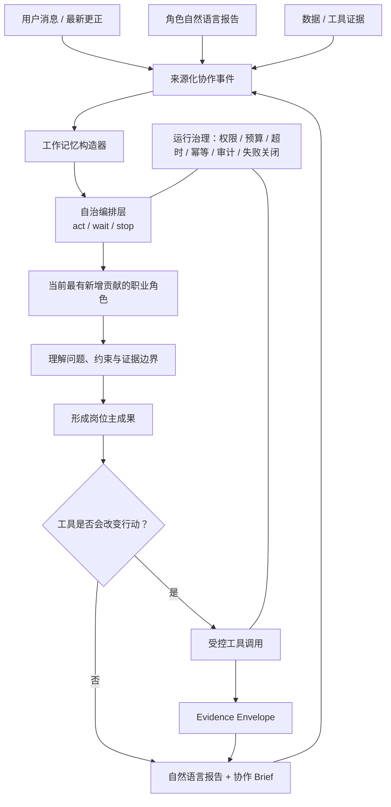

# TSagent：面向垂直领域的自治专业智能体设计

> **一套让专业角色独立理解自然语言、按需协作、受控调用工具，并能在复杂业务场景中稳定交付专业成果的智能体架构方法。**

TSagent 以买方投顾为首个实践场景，但设计目标并不限于金融：任何需要专业分工、长对话理解、外部证据与可审计协作的垂直领域智能体，都可以复用这套方法。

---

## 阅读目录

建议按以下顺序阅读：

| 顺序 | 文档 | 说明 |
|---:|---|---|
| 0 | [README](README.md) | 项目定位、核心架构与完整会谈案例。 |
| 1 | [WHITEPAPER](WHITEPAPER.md) | 主白皮书：问题、原则、关键创新与演进方向。 |
| 2 | [系统架构](docs/ARCHITECTURE.md) | 自治角色、事件层、编排层、工具层和治理层如何分工。 |
| 3 | [角色设计](docs/ROLES.md) | 五类职业角色的主成果、边界与扩展标准。 |
| 4 | [动态会谈协议](docs/MEETING_PROTOCOL.md) | 一次会谈如何从新事件走向角色选择、交付、等待或停止。 |
| 5 | [记忆系统](docs/MEMORY_SYSTEM.md) | 原始档案、工作记忆、上下文压缩和用户更正治理。 |
| 6 | [安全与边界](docs/SAFETY_AND_COMPLIANCE.md) | 语义判断与运行规则如何分界，如何保护角色与工具边界。 |
| 7 | [评估方法](docs/EVALUATION.md) | 如何按用户价值、专业能力、证据质量与可靠性验收。 |
| 附录 | [角色设计模板](templates/role-spec-template.md) | 为新垂直领域角色建立职责合同的可复用模板。 |

---

## 一句话定位

```text
自然语言工作记忆
+ 清晰的专业岗位职责
+ 低频事件驱动协作
+ 证据化工具闭环
= 可独立工作、可协作、可治理的垂直领域专业智能体
```

## 核心架构



## 当前五类职业角色

| 角色 | 本轮主成果 |
|---|---|
| 金融顾问 | 梳理真正需要决定的问题、冲突、前提失效与最小下一步。 |
| 理财规划师 | 输出资金分桶、方案比较、执行顺序与条件性规划。 |
| 风险分析师 | 审查流动性、回撤、集中度、期限错配与极端情景风险边界。 |
| 首席财务官（CFO） | 从家庭资产负债表、资本排序和预算压力角度整合决策。 |
| 数据分析师 | 输出可回查的外部事实、证据时点、适用范围与不确定性。 |

---

<a id="full-session-example"></a>

# 完整会谈案例：从用户更正到条件性方案

> **目的：** 展示五位职业角色如何围绕同一问题协作。以下金额、产品和工具结果均为抽象示例，不构成投资建议；“分析路径”是可审计的专业判断摘要，不是模型内部思维链。

## 场景与用户输入

用户第一次表达：

> 我 42 岁，伴侣 40 岁。家庭有 220 万元现金、120 万元权益基金，目前浮亏 18%。我们希望五年后降低工作强度；女儿三年后可能去海外读本科，预计要 80 万元。我不想让资金闲着，最近看到一个年化收益较高的产品，也担心错过机会。

用户补充并更正：

> 我要更正：220 万元里真正随时可用的只有 160 万元，另外 60 万元是合伙企业应收款，最快两年才能收回。家庭每月必要支出约 3.5 万元，父亲未来可能有医疗支出，但暂时无法估算。

系统先把“220 万元即时可用现金”标记为**失效前提**，后续所有角色都基于“160 万元即时流动性 + 60 万元两年受限应收款”工作。

## 角色 1：金融顾问——先定义真正要解决的问题

### 本轮输入

- 用户的长期目标：五年后降低工作强度；
- 三年内可能需要的教育资金：80 万元；
- 即时可用现金被更正为：160 万元；
- 已有权益基金浮亏；
- 用户希望追求较高收益，但尚未提供候选产品完整条款。

### 分析路径摘要

1. 区分“追求收益”与“先保障确定用途”两个不同问题；
2. 判断 60 万元应收款不能作为即时流动性；
3. 识别教育资金、半退休目标、父亲潜在医疗支出和权益浮亏之间存在资本排序冲突；
4. 判断当前不应直接讨论某个高收益产品，而应先确定流动性底线与候选产品的退出限制。

### 主成果

当前真正的决策问题不是“是否追高收益”，而是：在三年教育用途、潜在医疗责任、五年工作节奏调整和已有浮亏资产并存时，家庭还有多少资金可以承担长期波动或锁定期。

### 工具决策

**本轮不调用工具。** 原因是工具无法替代“教育用途是否确定、候选产品具体是什么、家庭医疗预留如何定义”等用户独有事实；金融顾问可以先完成决策框架，而不是因为信息不完整就无限追问。

### 对用户的回复

> 你现在最需要先决定的不是“怎样提高收益”，而是哪些资金绝不能因为追求收益而失去可用性。220 万元中能即时安排的金额已经从 220 万更正为 160 万，这会直接影响教育资金、家庭缓冲和长期投资之间的排序。下一步我建议先由数据分析师核验候选产品的退出限制，再由风险分析师确认在教育用途和收入变化情景下的流动性边界。

## 角色 2：数据分析师——把外部材料变成可引用证据

### 本轮输入

- 金融顾问的协作请求：核验候选高收益产品的退出限制和费用；
- 用户尚未给出完整产品名称，只提供了宣传信息中的“收益较高、可随时关注”。

### 分析路径摘要

1. 明确“收益宣传”不是产品条款；
2. 确认需要外部公开材料才能回答锁定期、赎回、费用和风险提示；
3. 将任务限定为事实核验，不对产品是否适合用户下结论。

### 工具调用

**调用：产品条款/公开资料检索工具**

- **输入：** 用户提供的候选产品名称或公开链接；
- **返回的 Evidence Envelope：** 持有期、赎回条件、退出费用、风险等级、资料发布日期、缺失条款；
- **示例结果：** 候选产品存在 180 天持有期，提前退出存在费用；宣传页未能证明本金保障；产品说明的发布日期早于当前会谈，需要后续确认是否仍有效。

### 工具结果如何帮助角色

工具没有告诉任何人“应该买或不买”，但它把“看起来收益高”转成可审查的证据：该产品可能与三年教育用途和潜在医疗支出存在流动性冲突。

### 对用户的回复

> 已核验到候选产品并非“随时可用的高收益现金替代品”：它存在持有期和提前退出成本，且公开材料不能证明本金保障。这个结果不等于产品一定不适合你，但意味着它不能在未明确教育资金与家庭缓冲前，被当作短期可动用资金。

## 角色 3：风险分析师——判断哪些风险不能被乐观预期覆盖

### 本轮输入

- 用户更正后的即时可用现金：160 万元；
- 教育用途：三年后可能需 80 万元；
- 每月必要支出：3.5 万元；
- 60 万元为两年受限应收款；
- 数据分析师确认候选产品有持有期和退出成本；
- 现有权益基金浮亏 18%。

### 分析路径摘要

1. 将教育用途、家庭日常开支和潜在医疗支出视为对流动性的竞争；
2. 不把受限应收款和浮亏权益基金视为即时缓冲；
3. 判断候选产品的锁定期是否会改变“可推进 / 应暂停”的风险结论；
4. 需要量化的不是收益，而是隔离短期义务后的资金缓冲是否仍足够。

### 工具调用

**调用：流动性覆盖期 / 压力测算工具**

- **输入来源：** 160 万即时现金、80 万教育预留、3.5 万月必要支出，均来自用户原话；
- **示例结果：** 教育资金隔离后剩余现金约 80 万，对应约 22.9 个月必要支出；如再预留 20 万潜在医疗缓冲，可覆盖约 17.1 个月；60 万应收款不计入即时覆盖；
- **Evidence Envelope 限制：** 医疗支出金额尚未知，计算只能作为情景压力结果，不能被解释为完整风险评级。

### 主成果

现阶段的风险边界是：教育资金与基本生活缓冲应优先隔离；受限应收款和已有浮亏权益资产不能被当作应急现金；在医疗预留和教育用途未进一步确认前，不应使用带锁定期的候选产品占用这些资金。

### 对用户的回复

> 你目前最大的风险不是“基金已经浮亏”，而是把本来承担教育、生活或医疗不确定性的资金进一步锁定。按已知情景，教育资金隔离后仍有一定生活覆盖期，但医疗预留尚未量化，因此候选产品只能被放在明确不影响短期用途的资金范围内讨论，而不能先投入再补救。

## 角色 4：理财规划师——把风险边界转为条件性方案

### 本轮输入

- 金融顾问给出的决策框架；
- 数据分析师提供的候选产品退出限制；
- 风险分析师给出的流动性边界和压力结果；
- 用户的五年降速目标、教育用途和现有权益资产。

### 分析路径摘要

1. 把资金按用途和期限区分，而不是按“收益高低”排序；
2. 将教育资金和家庭缓冲视为第一优先级；
3. 判断是否还需要再次调用现金跑道工具；
4. 比较“先锁定短期资金，再讨论长期配置”与“直接投入带锁定期产品”的执行顺序。

### 工具决策

**本轮不重复调用现金跑道工具。** 风险分析师已经发布了可引用的流动性压力证据，重复计算不会改变规划行动。理财规划师直接使用该证据形成方案，避免工具调用成为流程表演。

### 主成果

形成三层条件性资金安排：

1. **短期专用层：** 为三年教育用途隔离资金，不进入锁定期或高波动讨论；
2. **家庭缓冲层：** 在医疗预留尚未明确前，保留可随时动用的现金缓冲；
3. **长期配置层：** 仅用不影响前两层的剩余资金，讨论五年以上的长期资产配置与现有权益基金的处置策略。

### 对用户的回复

> 现在更合适的做法不是先问“高收益产品值不值得买”，而是先把钱按用途分开。教育资金和家庭缓冲不参与锁定期产品；只有在前两层隔离后确实不影响五年目标的资金，才进入长期配置比较。这样即使市场继续波动，也不会让三年内的重要用途被迫变现。

## 角色 5：首席财务官（CFO）——做整体资本排序与执行判断

### 本轮输入

- 用户原始目标与更正后的资金可用性；
- 数据分析师的产品条款证据；
- 风险分析师的流动性边界；
- 理财规划师的三层资金安排。

### 分析路径摘要

1. 从家庭整体资产负债表看，而不是单独看某个产品收益；
2. 判断 60 万受限应收款、教育用途、潜在医疗责任和权益浮亏对资本排序的影响；
3. 判断是否还存在一个量化结果会改变“先隔离 / 可执行长期配置”的最终排序；
4. 在现有证据已足够支持排序时，避免为了显得严谨而再调用一个不会改变行动的工具。

### 工具决策

**本轮不调用家庭资本测算工具。** 当前工具即使输出更精细的资产负债表比率，也不会改变“先隔离教育资金和家庭缓冲，再讨论长期资金”的资本排序。首席财务官选择直接交付执行判断。

### 主成果

家庭资本排序应为：

```text
教育用途与家庭缓冲
    > 潜在医疗不确定性的预留
        > 现有权益资产的风险管理
            > 新增长期配置或带锁定期产品
```

候选高收益产品不是当前第一步；它最多是长期配置层的待比较选项，前提是教育用途、现金缓冲和医疗预留均不受影响。

### 对用户的回复

> 从家庭整体资本安排看，你现在可以先完成“隔离和排序”，而不是立刻做“收益选择”。这不是放弃增值，而是先确保三年教育用途、家庭缓冲和潜在医疗责任不会被一项锁定期投资挤占。等这些边界明确后，再用真正长期的剩余资金比较收益、波动、流动性和成本，决策会更稳。

## 会谈为什么在这里结束

五个职业角色已经分别贡献了：决策框架、外部证据、风险边界、条件方案和资本排序。继续让角色发言不会增加价值。

若用户愿意继续，下一轮只需补充会改变方案的事实，例如：教育资金是否确定、医疗预留范围、候选产品完整名称，或五年目标下可接受的波动范围。系统不会重复召开一轮“所有人都再说一遍”的会议。

---

## 这套方法的核心区别

1. **角色是独立专业智能体，不是会议中的固定节点。**
2. **编排层只协调谁应上场，不替角色下专业结论。**
3. **跨角色用自然语言报告和证据交接，不依赖私有业务 JSON。**
4. **工具只在结果会改变岗位行动时调用，工具输出是证据而不是建议。**
5. **用户最新更正优先于旧摘要和旧角色报告。**
6. **没有新增价值时停止，比让所有角色重复发言更专业。**

## 公开边界

本仓库公开的是通用架构方法，不包含用户数据、密钥、生产配置、私有代码、真实会谈记录或具体投资建议。买方投顾仅是首个实践场景；任何真实客户部署仍需满足身份认证、租户隔离、隐私保护、合规与人工责任要求。
