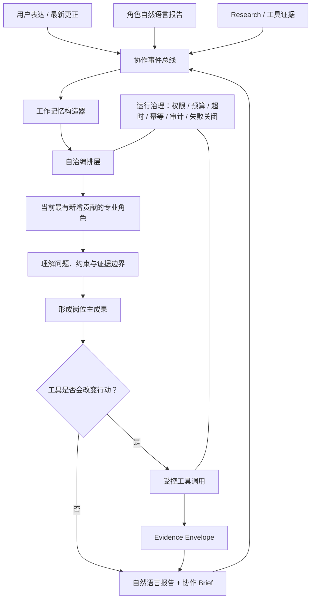

# TSagent：基于自治协作的买方投顾智能体系统

> **不是让多个 LLM 轮流发言，而是让多个专业角色能独立理解、互相审查、按需协作，并在证据与运行治理约束下交付可解释的财富管理分析。**

[阅读核心白皮书](WHITEPAPER.md) · [系统架构](docs/ARCHITECTURE.md) · [角色设计](docs/ROLES.md) · [会谈协议](docs/MEETING_PROTOCOL.md) · [记忆系统](docs/MEMORY_SYSTEM.md) · [安全与边界](docs/SAFETY_AND_COMPLIANCE.md) · [评估方法](docs/EVALUATION.md)

## 一句话定位

TSagent 是一个面向买方财富管理咨询的自治多智能体系统：它以专业角色的独立业务成果为中心，用低频事件驱动编排协调角色，用自然语言工作记忆传递上下文，用证据化工具闭环补充可核验事实。

## 它解决什么问题

传统理财问答通常是“一个模型 + 一个长 Prompt”。传统多智能体又容易退化为固定会议流程：角色顺序写死、缺一个字段就追问、工具按关键词调用、业务结论藏在私有 JSON 中。

TSagent 的目标是让每一位专家都满足：

```text
自然语言工作记忆
+ 明确岗位职责与边界
+ 经授权的专业工具
= 可独立完成本轮专业工作的自治角色
```

## 核心架构



## 当前五类核心角色

| 角色 | 职责主成果 |
|---|---|
| 决策架构师 | 把混乱咨询整理为真正需要决定的问题、冲突、前提失效与最小下一步。 |
| 财富规划师 | 给出资金分桶、方案比较、执行顺序与条件性规划。 |
| 风险分析师 | 识别流动性、回撤、集中度、期限错配和极端情景下不可跨越的边界。 |
| 家庭 CFO | 从家庭资产负债表和资本排序角度整合约束，形成可执行的资本判断。 |
| Research 分析师 | 产出可回查的外部事实、数据证据、时点与适用边界。 |

> 当前白皮书只描述已经在自治运行时中具备独立入口的五类角色。新增角色应按同一职责合同接入，而不是因为“会议里需要一个位置”而创建。

## 关键创新

1. **主成果合同**：每个角色先定义本轮必须创造的岗位价值，而不是先定义字段或固定流程。
2. **主成果与协作分离**：请求其他专家不等于本轮没有完成工作。
3. **自然语言协作协议**：跨角色传递报告、协作请求和带来源的证据，不依赖隐藏业务 JSON。
4. **事件驱动编排**：编排层只做 `act / wait / stop` 的低频协调，不替角色做专业判断。
5. **用户更正优先**：最新用户事实可使旧金额、旧期限、旧报告前提失效。
6. **反事实工具授权**：只有工具的不同结果会改变角色行动时才调用工具。
7. **Evidence Envelope**：工具输出事实、假设、限制和缺失证据，不直接输出业务建议。
8. **以业务价值验收**：不以“流程跑全”“工具调用率”或“唯一动作标签”为首要成功标准。

## 一个会谈示例

阅读 [完整样例](examples/sample-session.md)：它展示用户更正如何使旧前提失效、决策架构师如何重新定义问题、风险分析师如何设置边界、规划师如何形成条件方案，以及何时工具应该被拒绝或授权。

## 公开边界

本仓库是一份方法论白皮书，不含用户数据、密钥、生产配置、私有代码、真实会谈记录或具体投资建议。系统不承诺收益；强监管、交易执行、账户操作和最终适当性判断仍需要合规流程与人工责任主体。
