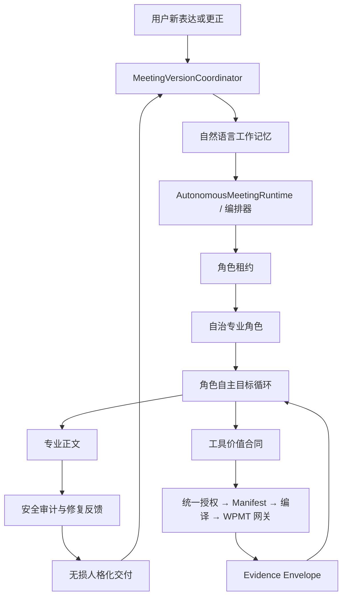

# 当前架构标准

## 1. 运行时总览



## 2. 六个稳定边界

| 边界 | 职责 | 不负责 |
|---|---|---|
| 版本协调器 | 把完整回合提交为唯一会谈版本；同步报告视图与等待合同 | 业务判断、角色选择、工具选择 |
| 编排器 / 运行时 | 路由角色、维护租约、恢复技术失败、管理等待状态 | 替角色做风险、规划或资本裁决 |
| 自治角色 | 理解、设定本轮目标、阶段交付、协作和工具价值判断 | 读取另一角色私有业务状态 |
| 工具层 | 计算、核验、返回来源化 Evidence Envelope | 推荐产品或输出最终专业裁决 |
| 安全审计 | 识别危险行为并提供修复反馈 | 因格式或不完整而吞掉已有成果 |
| 人格化交付 | 无损组织已经批准的专业正文 | 摘要、重做业务判断、删改条件与数字 |

## 3. 角色自主目标循环

角色不是执行预设任务树。每轮由同一次语义推理建立或更新当前目标：

1. 识别用户真正要解决的决策冲突和最新更正；
2. 写出当前可完成的岗位成果；
3. 区分可条件化推进的未知、必须向用户确认的事实、可由工具/Research 获取的事实、其他岗位判断；
4. 先交付阶段成果；
5. 仅在工具或协作会改变行动时继续；
6. 无新增价值时停止当前回合，但不关闭长期会谈。

## 4. 工具闭环标准

所有工具路径必须共享同一个授权事实。当前开发配置可以来自 `settings.eleanor_wpmt_scopes` 与敏感数据同意；生产目标必须升级为会话级、目的级、可撤销授权。

```text
可见性摘要
= Manifest 可见性
= 工具桥接 granted_scopes
= GatewayContext granted_scopes
```

任何一层不一致都属于工具层缺陷，不能用“工具不可用”掩盖。调用审计至少记录：候选工具、授权结果、Manifest 就绪结果、编译次数、网关状态、Evidence Brief、限制和对角色行动的影响。

## 5. 失败与恢复

- 模型、工具或网关失败：保留已确认事实和已批准专业正文；
- 产生技术连续性事件，而不是业务结论；
- 编排器决定续用角色、换角色、等待用户或条件性交付；
- 只有真正不存在安全业务成果时才显示纯技术维护提示；
- 等待用户不是终止会议；会话版本、记忆和角色租约必须可恢复。

## 6. 当前实现与待完成项

已实现：自主主运行时、会谈版本提交、角色租约、Eleanor 组合工具循环、无损人格化、工具显示/Manifest/桥接共享配置中心。

仍需持续验收：真实工具网关成功率、会话级授权替代开发环境全局同意、Qdrant 等依赖健康、所有角色采用同一交付与恢复标准。
