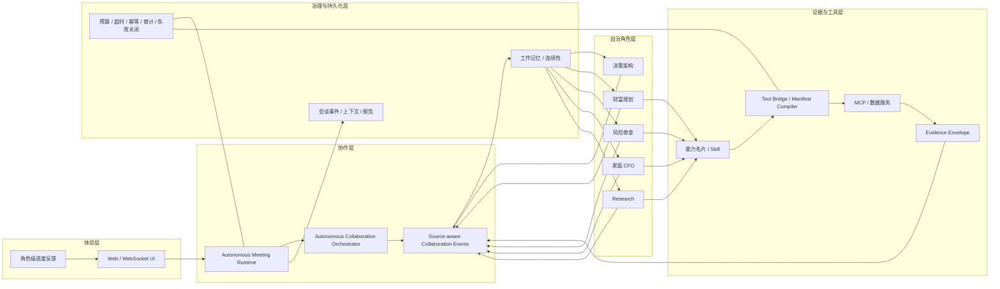

# 系统架构

## 1. 五层架构



## 2. 关键责任边界

### 2.1 自治角色

角色只读取自然语言工作记忆与运行时授权能力。它先理解本岗位问题、完成主成果，再判断是否需要最小追问、Research、专家协作、工具调用或停止。

### 2.2 自治编排层

编排器是协调器，不是业务专家。它根据当前事件包、角色能力与贡献判断，返回：

```text
act  -> 选择一位当前有新增贡献的角色
wait -> 需要等待用户独有事实或外部证据
stop -> 当前没有角色能带来新增专业价值
```

编排器不替角色决定风险等级、资金分桶或最终资本建议。

### 2.3 协作事件层

所有用户消息、角色报告、Research 证据和协作请求都以来源化事件进入会谈。业务内容是自然语言；事件 ID、版本、状态和时间只用于幂等、回放、排序和审计。

### 2.4 工具与证据层

工具服务只接收显式输入，返回 Evidence Envelope。它不读取角色私有状态，也不输出“应该买什么/应该怎么做”的业务裁决。

### 2.5 治理层

治理层负责权限、用户同意、预算、超时、有限重试、幂等、审计和失败关闭。它不能把专业判断变成静态规则图。

## 3. 为什么是低频事件编排

每次角色输出后都重新调用编排模型，会带来额外延迟和重复判断。TSagent 将协调压缩为“有新事件才调度”：用户更正、证据回流、角色完成、外部结果失败或未解决冲突变化，才会触发新一轮 `act / wait / stop` 判断。

对相同事件包，可使用任务指纹和短期决策缓存；对没有新增事实或新增贡献的情况，应直接停止。

## 4. 角色业务回合与技术并行

角色的专业判断通常按事件顺序交接，因为后续角色需要读到前序角色的自然语言结论。可以并行的是进度推送、事件持久化、独立 Research 获取、后台调度观察和非依赖技术任务。

因此，架构追求的是“避免编排器空转”，而不是让所有专家在事实版本不一致时同时下结论。
