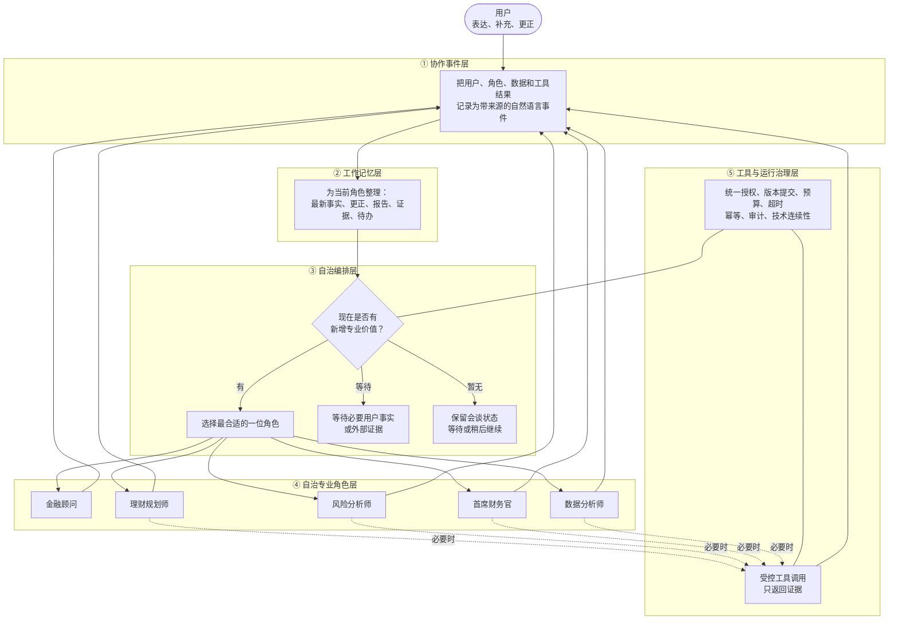

> [← 上一篇：核心白皮书](../WHITEPAPER.md) · [阅读目录](../README.md#阅读目录) · [下一篇：角色设计 →](ROLES.md)

# 系统架构

## 1. 先看全图：五层如何协作

> 图中每个框只描述一个职责；详细解释放在图后，避免把实现名词堆进图里。



## 2. 图例：每一层具体做什么

| 层级 | 图中职责 | 用通俗语言解释 |
|---|---|---|
| ① 协作事件层 | 记录所有协作输入与输出 | 让每句用户补充、每份角色报告、每条数据证据都有来源、时点和可回放顺序。 |
| ② 工作记忆层 | 为角色整理本轮所需上下文 | 不把整段聊天历史硬塞给模型；优先保留最新更正、关键金额/期限、证据和未解决问题。 |
| ③ 自治编排层 | 决定 `act / wait / hold` | 只协调“谁现在最该上场、谁应继续持有会谈”，不代替专业角色判断。 |
| ④ 自治专业角色层 | 独立完成岗位主成果 | 每个职业角色都能单独阅读工作记忆、形成判断、写报告和请求协作。 |
| ⑤ 工具与运行治理层 | 提供证据与技术保护 | 工具不直接给建议；治理不决定业务结论，只保证权限、成本、可靠性与审计。 |

## 3. 自治编排层到底是什么

自治编排层可以理解为**会谈协调员**，不是一个替所有专家思考的“超级模型”。它只回答：

```text
act  ：当前哪位职业角色能带来新增专业价值？
wait ：是否必须等用户确认某个独有事实，或等外部证据返回？
hold ：当前暂无新增动作，但会谈仍可在用户补充、跨时间继续或技术恢复后推进。
```

因此，编排层不会决定“风险是否可承受”“资金如何配置”或“是否应该购买某产品”；这些结论必须由对应职业角色给出。用户正在回应某位角色的关键问题时，默认恢复该角色的会谈租约，而不是每句话重新抢占专业判断权。

### 3.1 会谈租约与版本化快照

当前角色获得的是可恢复的**会谈租约**：它在本岗位仍有未完成但可推进的目标时继续有效；用户补充、纠正或回答其关键问题时，系统优先把工作记忆交还给该角色。只有出现新的岗位冲突、明确委托或角色已完成本轮目标时，编排层才重新协调。

业务语义保存在自然语言事件、报告和证据中；技术一致性由单调递增的会谈版本管理。前端只消费一次完整提交的快照，不能把数据库、缓存和浏览器中不同进度的会谈片段拼成“当前状态”。版本协调器只负责提交、幂等与恢复，不评价专业结论。

## 4. 一次工具调用的位置

工具不是角色回合中必经的固定步骤。角色先完成自己的专业分析，再判断工具结果是否会改变当前行动：

```text
角色形成主成果
   ↓
工具结果会不会改变本岗位行动？
   ├─ 不会：直接写条件性报告 / 请求协作
   └─ 会：授权一次工具调用 → 返回 Evidence Envelope → 角色收束报告
```

Evidence Envelope 应至少说明：工具事实、输入来源、假设、时点、限制和缺失证据。工具输出不是最终建议，最终解释权仍在专业角色。

工具是否可见、Manifest 是否允许、桥接是否放行、网关是否执行，必须读取同一份授权事实。开发环境的全局配置只能用于验证能力；生产授权还应做到按会话、用途与范围可撤销，不能把“系统已经配置”误写成“用户已经同意”。

## 4.1 交付与质量审计不应吞掉成果

角色先形成可审查的专业正文；质量审计只隔离伪造事实或来源、关键事实冲突、越权、权限破坏与安全风险。它不因字段未齐、格式投影失败、工具未运行或目标尚未全部完成而撤销已有阶段成果。

通过审计后，交付层只做无损的可读性与角色语气润色：不得重做业务判断、删除条件与行动顺序，或把专业正文压缩成泛化安全话术。只有模型或系统真正不可用且没有任何安全业务成果时，才输出纯技术维护提示。

## 5. 为什么角色不全部同时并行

角色结论常相互依赖：理财规划师需要理解风险边界；首席财务官需要理解规划方案和数据证据。因此，专业判断以事件顺序交接。

可以并行的是前端进度、事件持久化、独立数据获取和后台技术任务。系统优化目标是减少编排器空转，不是让角色在不同事实版本上同时给出冲突结论。

---

> [← 上一篇：核心白皮书](../WHITEPAPER.md) · [阅读目录](../README.md#阅读目录) · [下一篇：角色设计 →](ROLES.md)
