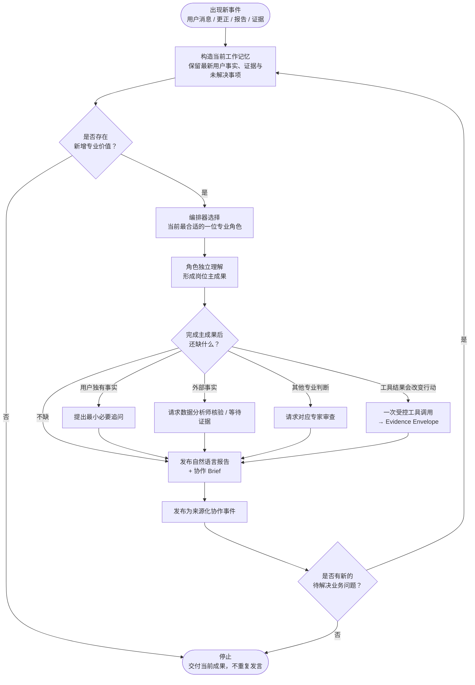

> [← 上一篇：角色设计](ROLES.md) · [阅读目录](../README.md#阅读目录) · [下一篇：记忆系统 →](MEMORY_SYSTEM.md)

# 动态会谈协议

## 先理解这张图

会谈**不是没有流程**，而是流程不会预先写死“谁先说、谁后说”。每当出现用户消息、用户更正、角色报告或外部证据时，系统都根据当前未解决的业务问题动态决定：

- 现在是否有角色能创造新增专业价值？
- 如果有，应该由哪一位角色上场？
- 如果没有，是等待必要信息，还是应该结束本轮会谈？



## 1. 核心原则

> **不是角色按顺序开会，而是问题驱动角色上场。**

用户提出问题后，系统不预设“先金融顾问、再理财规划师、最后首席财务官”。当前最有价值的角色可能是风险分析师，也可能是数据分析师，甚至可能没有任何角色应该继续发言。

## 2. 编排器只做三类决定

| 决定 | 含义 | 典型结果 |
|---|---|---|
| `act` | 当前有一位角色能带来新增专业价值 | 调度该角色完成自己的主成果。 |
| `wait` | 关键事实只能由用户或尚未返回的外部证据提供 | 提出最小追问，或等待数据证据回流。 |
| `stop` | 继续发言不会带来新增价值 | 结束会谈并交付当前可用成果。 |

编排器不决定资产配置、不判断风险是否可接受，也不替角色写报告；它只负责协调“谁应该做下一步”。

## 3. 一次角色回合如何交付

每个角色输出两层自然语言内容：

```text
主成果（report_text）
- 本角色已经完成的专业判断、事实边界、条件和下一步价值。

协作 Brief（collaboration_brief）
- 只有确有必要时才说明：应由谁补什么，或为什么应停止。
```

这样，“请求别人继续”不会掩盖本角色已经完成的工作。

## 4. 什么时候允许追问用户

只有同时满足以下条件才追问：

1. 该事实只能由用户确认；
2. 当前上下文、角色报告和证据没有答案；
3. 不同答案会改变本轮成果或行动；
4. 无法通过条件性方案、数据核验、专家协作或停止继续推进。

因此，信息不完整不等于立即追问；用户注意力是有限资源。

## 5. 为什么角色业务回合不完全并行

角色往往需要读取其他角色的新报告。例如规划师需要先理解风险边界，首席财务官需要理解规划方案和证据。因此，专业业务判断以事件顺序交接。

可并行的是前端进度推送、事件持久化、独立外部证据获取和后台技术任务。系统避免的是“编排器高频空转”，而不是为了并行让角色基于不同事实版本同时下结论。

---

> [← 上一篇：角色设计](ROLES.md) · [阅读目录](../README.md#阅读目录) · [下一篇：记忆系统 →](MEMORY_SYSTEM.md)
