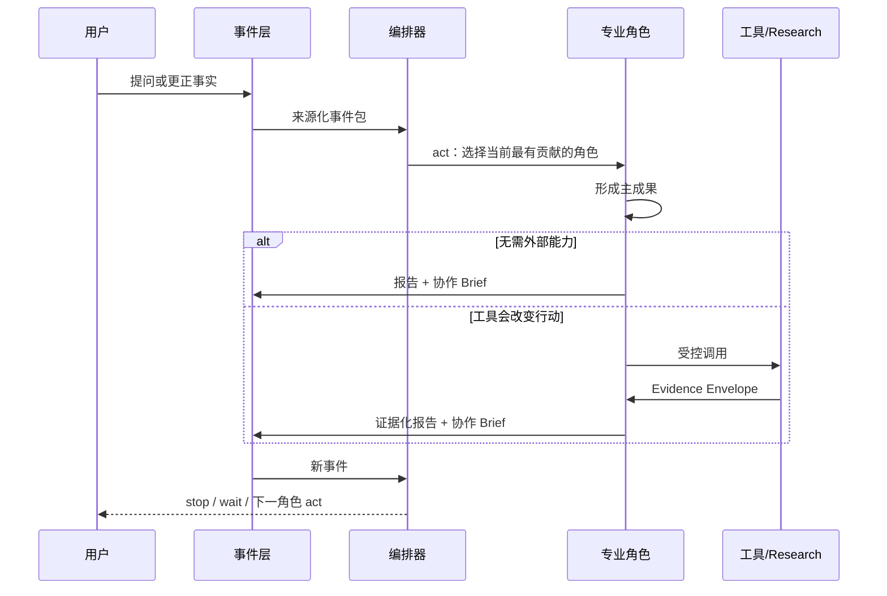

# 动态会谈协议

## 1. 会谈不是固定发言顺序

TSagent 不采用“角色 1 → 角色 2 → 角色 3 → 最终角色”的硬编码会议图。会谈以当前尚未解决的业务任务为中心：谁能带来新增专业价值，谁才被调度。



## 2. 编排器的三种决定

### `act`

当某位角色能够基于当前事实、报告或证据创造新增专业价值时，编排器选择该角色。选择理由应包含：当前问题、为什么现在需要该角色、该角色预计交付什么。

### `wait`

只有当关键事实确实只能由用户确认，或外部证据尚未返回并且无法通过条件性报告继续推进时，才等待。`wait` 必须带具体原因，不能用“资料不足”笼统代替判断。

### `stop`

当没有角色能带来新增贡献时停止。停止不是失败，而是对用户注意力、成本和系统可信度的保护。

## 3. 一次角色回合的输出协议

每个角色回合产生两层业务输出：

```text
report_text：本角色已经完成的自然语言专业成果。
collaboration_brief：下一步协作请求、待核验证据或停止原因。
```

运行时还可保存状态、预算、超时、审计 ID 和错误标记，但这些技术字段不能取代业务报告。

## 4. 追问纪律

“信息未知”不自动等于“问用户”。只有同时满足以下条件才追问：

1. 事实只能由用户确认；
2. 现有上下文、角色报告和证据都没有答案；
3. 不同答案会改变本轮主成果或行动；
4. 无法通过条件性报告、Research、专家协作或停止继续推进。

## 5. 防止无效回合

- 同一事实包使用任务指纹去重；
- 角色必须说明本轮新增贡献；
- 上一轮已问问题要检查用户是否已回答或更正；
- 工具失败、Research 晚到和重复请求应进入受控关闭/回放路径；
- 总回合数、总延迟和工具调用数均受预算约束。
