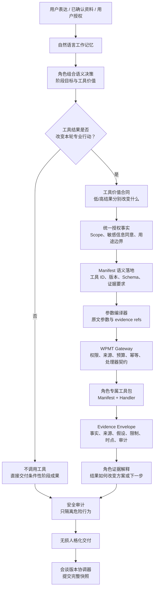

> [← 上一篇：系统架构](ARCHITECTURE.md) · [阅读目录](../README.md#阅读目录) · [下一篇：角色设计 →](ROLES.md)

# 工具与运行：让角色获得可核验能力，而不是把业务做成规则流程

## 1. 工具层的职责

角色的专业能力来自岗位理解、阶段目标、经验框架与跨角色协作；工具层只补足其中**可计算、可检索、可核验、可重复执行**的一部分。工具不替角色做决策，也不把对话强行塞进固定流程。

一次合格的工具调用应遵循：

```text
角色先形成当前专业判断
→ 说明工具结果为什么会改变本轮行动
→ 仅用可追溯原话编译参数
→ 在授权、预算、证据约束下执行
→ 返回 Evidence Envelope
→ 原角色解释证据如何改变方案、边界或最小下一步
```

这与“检测到基金、房贷、保险等词就调用函数”不同。工具是角色的受控专业能力；编排器不按关键词指定工具，Gateway 也不评价专业建议。

## 2. 当前真实工具与运行架构

> 下图以 Eleanor 已跑通的工具闭环为参考路径。Nicholas、Warren 和 Research 已有角色专属包与桥接层，但“工具已安装”不等于“每个角色均已完成同等前后端端到端验收”。



独立 Mermaid 源文件见 [`diagrams/tool_runtime_architecture.mmd`](../diagrams/tool_runtime_architecture.mmd)。

## 3. 工具闭环的九个边界

| 边界 | 它负责什么 | 它不能做什么 |
|---|---|---|
| 角色组合语义决策 | 理解用户最新表达，设定当前阶段目标，判断工具是否有价值。 | 不能由关键词规则、工具清单或编排器替代。 |
| 工具价值合同 | 说明低/高结果分别会改变哪条行动、边界或下一步。 | 不能把“我不知道怎么办”伪装成调用理由。 |
| 统一授权事实 | 为可见性、Manifest、桥接和 Gateway 提供同一份 Scope、敏感数据同意与用途边界。 | 不能让四个模块各自读取不同环境开关。 |
| Tool Manifest | 声明工具 ID、版本、用途、输入 Schema、权限、PII 与证据/发布约束。 | 不是业务路由规则，也不是角色结论。 |
| 参数编译器 | 从工作记忆的可追溯原话提取参数和 `evidence_refs`，必要时修复 Schema 形状。 | 不改选工具，不补编金额、利率、期限或用户授权。 |
| WPMT Gateway | 校验授权、敏感信息同意、输入来源、回合预算、幂等、Handler 与返回契约。 | 不读取角色私有业务状态，不判断建议是否专业。 |
| 工具 Handler | 在 Manifest 边界内计算、查询、整理或核验。 | 不直接把结果写成最终投资建议。 |
| Evidence Envelope | 返回事实、来源、假设、缺失证据、限制、时点、置信度与审计引用。 | 不伪装成用户事实或最终资产配置结论。 |
| 角色解释与交付 | 解释证据是否改变方案，再无损组织成用户能理解的话。 | 不删除专业正文的关键条件、数字、限制和行动顺序。 |

### 3.1 工具可见不等于可以调用

角色可见性服务只把当前授权范围内的能力用自然语言放进工作记忆；这能让角色知道“现在有什么可用工具”。真正执行前仍要经过价值合同、授权检查、Manifest 语义落地、参数编译和 Gateway。

因此，以下四处必须使用同一份授权事实：

```text
工具展示
= Manifest 可发现范围
= 角色桥接可调用范围
= GatewayContext 的最终执行范围
```

否则会出现两种典型权限漂移：用户界面看得到但网关拒绝；页面隐藏但桥接仍可执行。开发环境的全局 Scope 仅用于验证能力，不能等同于生产用户的会话级同意。

### 3.2 为什么要有 Manifest 和参数编译器

自然语言里可能有“65 万现金”“两年内可能换房”“每月支出约 2.6 万”等事实；工具却需要严格的输入 Schema。参数编译器只做自然语言事实到工具合同的映射，并要求每个输入能回指工作记忆中的原话。

这解决的是“模型理解了材料，却不能稳定把材料填入正确工具合同”的问题。若一个必填输入没有可靠原文，编译器应返回空结果或修复请求；角色随后保留无工具的条件性成果、说明还缺什么，绝不能用默认数字硬填。

### 3.3 Gateway 为什么不保存业务状态

Gateway Context 只携带客户端、租户、回合、授权 Scope 和敏感数据同意，不携带家庭财务、角色计划或用户目标。这样 Gateway 只负责技术治理：

1. 幂等重放；
2. 授权和预算；
3. 输入来源与证据要求；
4. 对应 Handler 是否可用；
5. 返回是否符合 Evidence Envelope 契约；
6. 审计记录。

业务语义始终留在角色自然语言工作记忆、专业正文和 Evidence Envelope 中，而不是藏入网关私有状态。

### 3.4 工具慢、失败或被拒绝时应该发生什么

执行 Sidecar 只负责观察耗时和推送“仍在处理中”的进度，不创造业务语义。工具慢、无权限、参数缺证据、查询失败或返回不能改变结论时，角色应根据已有事实条件性推进，并清楚说明限制。

工具失败不等于会谈失败，更不等于角色必须重新问一长串表单问题。只有模型或基础设施真实不可用、且没有任何安全业务成果时，才允许输出不含业务判断的技术维护提示。

## 4. 当前 WPMT 工具包地图（截至 2026-07-24）

当前目录共有 **58** 个 WPMT 工具包。下表描述“已安装并可被 Runtime 发现”的工具，不把它误写成所有角色均已完整上线。

| 角色 / 归属 | 当前包数 | 主要作用 | 岗位边界 |
|---|---:|---|---|
| Eleanor｜理财规划师 | 30 | 现金流、目标资金桶、组合治理、保障、退休情景。 | 当前组合工具闭环的参考实现；不替代 Nicholas 风险放行或 Warren 最终资本裁决。 |
| Nicholas｜风险分析师 | 12 | 流动性、债务、收入中断、组合暴露/压力、责任和治理台账。 | 用于形成风险证据与暂停/保护边界，不替用户选偏好。 |
| Warren｜家庭 CFO | 4 | 现金流阶梯、资金锁定、费用拖累、提前还贷与替代投资情景。 | 用于资本排序的事实和情景，不替代风险复核或外部研究。 |
| Research｜数据分析师 | 11 | 宏观、公司、市场、基金、ETF、SEC 与政策资料的来源化核验。 | 只发布可回查事实与限制，不输出最终理财建议。 |
| Shared｜跨角色 | 1 | 文档/合同中的条款文本定位。 | 只定位原文，不解释业务结论。 |
| Charles｜决策架构师 | 0 | 当前没有启用专属 WPMT 包。 | 其职责是理解咨询、整理决策框架和协作；不应为了工具覆盖率强加调用。 |

> 项目中旧 `app/mcp/tools` 兼容代码不等于当前 WPMT 自治主路径，也不应作为新角色接入标准。

### 4.1 Eleanor：30 个规划工具，按四个专业域拆包

| 专业域 | 工具 ID | 解决的问题 |
|---|---|---|
| 现金流与目标（7） | `wealth.cashflow.diagnostic`、`wealth.cashflow.expense-structure`、`wealth.cashflow.goal-gap`、`wealth.cashflow.income-shock`、`wealth.cashflow.lifecycle-forecast`、`wealth.cashflow.runway`、`wealth.cashflow.savings-rate-gap` | 将收入、支出、目标、储蓄率与收入中断转成诊断、资金缺口和续航情景。 |
| 资金桶与组合治理（8） | `wealth.portfolio.account-inventory`、`wealth.portfolio.drift-analysis`、`wealth.portfolio.goal-benchmark`、`wealth.portfolio.goal-risk-budget`、`wealth.portfolio.liquidity-reserve`、`wealth.portfolio.rebalance-threshold`、`wealth.portfolio.selloff-scenario`、`wealth.portfolio.time-horizon-buckets` | 区分期限资金、流动性储备、组合偏离、再平衡和下跌出售风险。 |
| 保障与保险（7） | `wealth.protection.beneficiary-audit`、`wealth.protection.coverage-gap`、`wealth.protection.income-replacement`、`wealth.protection.policy-inventory`、`wealth.protection.premium-budget`、`wealth.protection.scenario-evidence`、`wealth.protection.waiting-period` | 整理保单资料、保障缺口、收入替代、保费占用、等待期与场景证据。 |
| 退休规划（8） | `wealth.retirement.home-equity-scenario`、`wealth.retirement.inflation-segment-stress`、`wealth.retirement.long-term-care-stress`、`wealth.retirement.multi-stage-cashflow`、`wealth.retirement.pension-scenario`、`wealth.retirement.readiness`、`wealth.retirement.replacement-rate`、`wealth.retirement.withdrawal-order` | 将住房权益、通胀、长期护理、养老金和多阶段现金流转成退休情景。 |

### 4.2 Nicholas：12 个风险工具

`risk.counterparty.exposure-map`、`risk.debt.service-metrics`、`risk.family.income-replacement-gap`、`risk.family.liability-map`、`risk.governance.event-timeline`、`risk.governance.review-register`、`risk.household.runway`、`risk.income.interruption-scenario`、`risk.liquidity.maturity-gap`、`risk.portfolio.exposure-map`、`risk.portfolio.stress-scenario`、`risk.product.structure-evidence-map`。

这些包服务于“能否承受、哪里不能承受、何时暂停、需要什么保护条件”的风险岗位成果，而不是为了给出一个看似精确的投资比例。

### 4.3 Warren：4 个家庭资本工具

`family-cfo.cashflow.ladder`、`family-cfo.fee.drag`、`family-cfo.liquidity.lockup-impact`、`family-cfo.mortgage.prepay-scenario`。

它们帮助 Warren 比较资金占用、长期费用和提前还贷与替代方案的资本后果；最终资本优先级仍由 Warren 在目标、风险边界和证据基础上说明。

### 4.4 Research：11 个证据工具

`research.company.financial-summary`、`research.macro.indicator`、`research.market.fund-info`、`research.market.stock-history`、`research.sec.company-submissions`、`research.source.assessment`、`research.source.reconciliation`、`research.us.etf.vanguard-profile`、`research.us.labor-inflation`、`research.us.policy-document`、`research.us.policy-evidence`。

Research 的成果应是可回查 Brief：资料从哪里来、对应什么时点、适用什么范围、与其他来源是否一致、还缺什么证据。查到数据不等于拥有替代规划、风险或 CFO 判断的权限。

### 4.5 共享工具与敏感数据

`document.clause.locator` 用于定位文档原文条款。保单、受益人等工具可能要求高敏感资料权限；现金流、资产、风险与 CFO 工具通常涉及金融敏感信息。权限应由统一授权事实控制，而不是由某个角色的 Prompt 自行承诺。

## 5. 新增一个角色能力时，怎样接入专属工具包

新增能力不应先把外部 API 塞进角色 Prompt，而应按以下顺序：

1. **定义岗位独有成果。** 写清角色要解决什么专业问题、不能替谁做决定、什么情况下即使不用工具也能交付阶段价值。
2. **拆成小而清晰的工具包。** 一个包只解决一个可核验问题，例如“现金流续航”，而不是“家庭理财万能分析”。
3. **编写 Manifest 和 Handler。** Manifest 声明版本、输入 Schema、Scope、PII、证据与发布约束；Handler 只实现计算、检索或核验，不读取角色私有状态。
4. **定义 Evidence Envelope。** 成功时必须有 Evidence Brief；失败时必须有原因码；同时返回事实、假设、限制、来源、时点和审计引用。
5. **接入角色可见性、授权、Manifest 落地、编译器与桥接。** 角色决定是否使用；编译器只映射事实；Gateway 统一执行治理。
6. **定义证据解释。** 工具回来后，角色必须说明它是否改变资金分桶、风险边界、资本排序或需要确认的最小事实。
7. **用真实会谈验收。** 至少覆盖应调用、不应调用、授权拒绝、参数缺证据、Schema 修复、工具失败、证据不改变结论、用户更正和长对话恢复。

WPMT Runtime 从包目录自动发现 Manifest 并注册 Handler，而不是维护不断膨胀的中央工具注册表。因此扩展一个新角色，原则上是“开发角色专属包并接入统一合同”，而不是修改全部既有角色或给编排器增加关键词路由。

## 6. 这种设计带来的优势

| 优势 | 为什么成立 |
|---|---|
| 角色能力可扩展 | 新能力按岗位专属包加入，不会把所有业务混入一个万能工具或总 Prompt。 |
| 专业边界清楚 | 工具提供证据，角色承担解释；Research、风险、规划和 CFO 不会因共享接口而越权。 |
| 比字段规则更稳 | LLM 先理解语义和阶段目标，再判断工具价值；编译器只负责合同映射，不决定业务路径。 |
| 比直接调 API 更安全 | Scope、敏感数据同意、来源、预算、幂等和审计由 Gateway 统一执行。 |
| 更容易定位问题 | 可分别观察工具候选、授权、Manifest、参数编译、Gateway、Handler、Evidence Envelope、证据解释和最终交付。 |
| 工具失败不吞用户价值 | 已有专业正文和阶段成果仍可交付；工具只影响它本应影响的那一小段判断。 |
| 支持长期演进 | 版本化 Manifest、独立包、Handler、审计和运行时发现让旧包可替换、新包可灰度。 |

## 7. 当前已实现与后续目标必须分开

**当前已实现的基座：** WPMT 包发现与 Handler 注册、Manifest、Gateway、Evidence Envelope、角色专属桥接/编译器、工具执行进度 Sidecar，以及 Eleanor 的组合工具闭环参考路径。

**仍应继续完成的生产化事项：** 按会话/用途/范围可撤销的真实用户授权、各角色完整前后端端到端验收、外部数据源健康度与来源评级、工具包签名策略的正式启用、跨实例审计与成本治理。

方法论文档应展示目标架构与已验证参考实现，但不能把“包已经存在”或“开发环境全局 Scope 已开启”写成“所有用户、所有角色、所有生产会谈都已授权且稳定可用”。

---

> [← 上一篇：系统架构](ARCHITECTURE.md) · [阅读目录](../README.md#阅读目录) · [下一篇：角色设计 →](ROLES.md)
